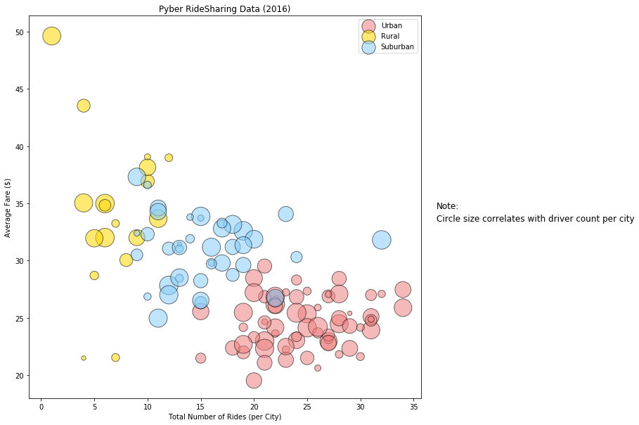

```python
# Observed Trend 1: Urban cities have the highest number of rides per city and the lowest averages fares while rural cities have the opposite.
# Observed Trend 2: The total drivers per city seems to be uniform across the different types of cities
# Observed Trend 3: Urban cities have the highest percentage of fares, rides, and drives across the city types

```


```python
# Import Dependencies
import matplotlib.pyplot as plt
import pandas as pd
import numpy as np
```


```python
# Import ride data into pandas from CSV

ride_data_df = pd.read_csv("ride_data.csv")
ride_data_df.head()
```


<div>
<style scoped>
    .dataframe tbody tr th:only-of-type {
        vertical-align: middle;
    }

    .dataframe tbody tr th {
        vertical-align: top;
    }

    .dataframe thead th {
        text-align: right;
    }
</style>
<table border="1" class="dataframe">
  <thead>
    <tr style="text-align: right;">
      <th></th>
      <th>city</th>
      <th>date</th>
      <th>fare</th>
      <th>ride_id</th>
    </tr>
  </thead>
  <tbody>
    <tr>
      <th>0</th>
      <td>Sarabury</td>
      <td>2016-01-16 13:49:27</td>
      <td>38.35</td>
      <td>5403689035038</td>
    </tr>
    <tr>
      <th>1</th>
      <td>South Roy</td>
      <td>2016-01-02 18:42:34</td>
      <td>17.49</td>
      <td>4036272335942</td>
    </tr>
    <tr>
      <th>2</th>
      <td>Wiseborough</td>
      <td>2016-01-21 17:35:29</td>
      <td>44.18</td>
      <td>3645042422587</td>
    </tr>
    <tr>
      <th>3</th>
      <td>Spencertown</td>
      <td>2016-07-31 14:53:22</td>
      <td>6.87</td>
      <td>2242596575892</td>
    </tr>
    <tr>
      <th>4</th>
      <td>Nguyenbury</td>
      <td>2016-07-09 04:42:44</td>
      <td>6.28</td>
      <td>1543057793673</td>
    </tr>
  </tbody>
</table>
</div>


```python
# Import city data into pandas from CSV

city_data_df = pd.read_csv("city_data.csv")
city_data_df.head()
```


<div>
<style scoped>
    .dataframe tbody tr th:only-of-type {
        vertical-align: middle;
    }

    .dataframe tbody tr th {
        vertical-align: top;
    }

    .dataframe thead th {
        text-align: right;
    }
</style>
<table border="1" class="dataframe">
  <thead>
    <tr style="text-align: right;">
      <th></th>
      <th>city</th>
      <th>driver_count</th>
      <th>type</th>
    </tr>
  </thead>
  <tbody>
    <tr>
      <th>0</th>
      <td>Kelseyland</td>
      <td>63</td>
      <td>Urban</td>
    </tr>
    <tr>
      <th>1</th>
      <td>Nguyenbury</td>
      <td>8</td>
      <td>Urban</td>
    </tr>
    <tr>
      <th>2</th>
      <td>East Douglas</td>
      <td>12</td>
      <td>Urban</td>
    </tr>
    <tr>
      <th>3</th>
      <td>West Dawnfurt</td>
      <td>34</td>
      <td>Urban</td>
    </tr>
    <tr>
      <th>4</th>
      <td>Rodriguezburgh</td>
      <td>52</td>
      <td>Urban</td>
    </tr>
  </tbody>
</table>
</div>


```python
merged_df = pd.merge(ride_data_df, city_data_df, on="city")
merged_df.head()
```


<div>
<style scoped>
    .dataframe tbody tr th:only-of-type {
        vertical-align: middle;
    }

    .dataframe tbody tr th {
        vertical-align: top;
    }

    .dataframe thead th {
        text-align: right;
    }
</style>
<table border="1" class="dataframe">
  <thead>
    <tr style="text-align: right;">
      <th></th>
      <th>city</th>
      <th>date</th>
      <th>fare</th>
      <th>ride_id</th>
      <th>driver_count</th>
      <th>type</th>
    </tr>
  </thead>
  <tbody>
    <tr>
      <th>0</th>
      <td>Sarabury</td>
      <td>2016-01-16 13:49:27</td>
      <td>38.35</td>
      <td>5403689035038</td>
      <td>46</td>
      <td>Urban</td>
    </tr>
    <tr>
      <th>1</th>
      <td>Sarabury</td>
      <td>2016-07-23 07:42:44</td>
      <td>21.76</td>
      <td>7546681945283</td>
      <td>46</td>
      <td>Urban</td>
    </tr>
    <tr>
      <th>2</th>
      <td>Sarabury</td>
      <td>2016-04-02 04:32:25</td>
      <td>38.03</td>
      <td>4932495851866</td>
      <td>46</td>
      <td>Urban</td>
    </tr>
    <tr>
      <th>3</th>
      <td>Sarabury</td>
      <td>2016-06-23 05:03:41</td>
      <td>26.82</td>
      <td>6711035373406</td>
      <td>46</td>
      <td>Urban</td>
    </tr>
    <tr>
      <th>4</th>
      <td>Sarabury</td>
      <td>2016-09-30 12:48:34</td>
      <td>30.30</td>
      <td>6388737278232</td>
      <td>46</td>
      <td>Urban</td>
    </tr>
  </tbody>
</table>
</div>


```python
tot_drivers_city = city_data_df["driver_count"]
tot_drivers_city.head()
```


    0    63
    1     8
    2    12
    3    34
    4    52
    Name: driver_count, dtype: int64


```python
city_group = merged_df.groupby(['type','city'])
tot_rides_city = city_group['ride_id'].count()

urban_count  = tot_rides_city.loc["Urban"]

rural_count  = tot_rides_city.loc["Rural"]

sub_count  = tot_rides_city.loc["Suburban"]
sub_count.head()
```


    city
    Anitamouth       9
    Campbellport    15
    Carrollbury     10
    Clarkstad       12
    Conwaymouth     11
    Name: ride_id, dtype: int64


```python

avg_fare = city_group['fare'].mean()

urban_avg = avg_fare.loc["Urban"]

rural_avg = avg_fare.loc["Rural"]

sub_avg = avg_fare.loc["Suburban"]
sub_avg.head()
```


    city
    Anitamouth      37.315556
    Campbellport    33.711333
    Carrollbury     36.606000
    Clarkstad       31.051667
    Conwaymouth     34.591818
    Name: fare, dtype: float64


```python
import seaborn as sns

plt.figure(figsize = (10, 10))

plt.title("Pyber RideSharing Data (2016)")
plt.xlabel("Total Number of Rides (per City)")
plt.ylabel("Average Fare ($)")

plt.scatter(urban_count, urban_avg, marker="o", facecolors="lightcoral", edgecolors="black", s=10*tot_drivers_city, alpha=0.55, label = "Urban")
plt.scatter(rural_count, rural_avg, marker="o", facecolors="gold", edgecolors="black", s=10*tot_drivers_city, alpha=0.55, label = "Rural")
plt.scatter(sub_count, sub_avg, marker="o", facecolors="lightskyblue", edgecolors="black", s=10*tot_drivers_city, alpha=0.55, label = "Suburban")
plt.legend(loc="best")
plt.text(.93, 0.5, "Note:", fontsize=12, transform=plt.gcf().transFigure)
plt.text(.93, 0.475, "Circle size correlates with driver count per city", fontsize=12, transform=plt.gcf().transFigure)
```


    Text(0.93,0.475,'Circle size correlates with driver count per city')





```python
citygrp = city_data_df.groupby('type')

tot_drivers = citygrp['driver_count'].sum()

tot_drivers
```


    type
    Rural        104
    Suburban     635
    Urban       2607
    Name: driver_count, dtype: int64


```python
explode =(0,0,0.05)
colors = ['gold', 'lightskyblue', 'lightcoral',]
types = ['Rural', 'Suburban', 'Urban']

plt.figure(figsize = (9, 9))

plt.pie(tot_drivers, explode = explode, colors=colors, labels=types, autopct="%1.1f%%", shadow=True, startangle = 140)

plt.title("% of Total Drivers by City Type")

plt.show()
```


```python
type_merged = merged_df.groupby('type')

tot_fare = type_merged['fare'].sum()

tot_fare
```


    type
    Rural        4255.09
    Suburban    19317.88
    Urban       40078.34
    Name: fare, dtype: float64


```python
plt.figure(figsize = (9, 9))

plt.pie(tot_fare, explode = explode, colors=colors, labels=types,  autopct="%1.1f%%", shadow=True, startangle = 140)

plt.title("% of Total Fares by City Type")

plt.show()
```


```python
tot_rides = type_merged['ride_id'].count()

tot_rides
```


    type
    Rural        125
    Suburban     625
    Urban       1625
    Name: ride_id, dtype: int64


```python
plt.figure(figsize = (9, 9))

plt.pie(tot_rides, explode = explode, colors=colors, labels=types, autopct="%1.1f%%", shadow=True, startangle = 140)

plt.title("% of Total Rides by City Type")

plt.show()
```


